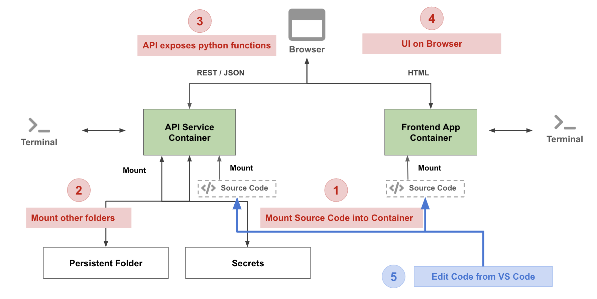

# Mushroom App - Setup & Code Organization

In this tutorial we will setup two containers:
* api-service
* frontend-simple

The following container architecture is what we will implement:


## Prerequisites
* Have Docker installed
* Have VSCode or editor of choice

## Setup Environments
In this tutorial we will setup containers to run python code for creating APIs and a container to run HTML web server.


### Clone the github repository
- Clone or download from [here](https://github.com/dlops-io/mushroom-app-v1)

### Create a local **secrets** folder

It is important to note that we do not want any secure information in Git. So we will manage these files outside of the git folder. At the same level as the `mushroom-app-v1` folder create a folder called **secrets**

Your folder structure should look like this:
```
   |-mushroom-app-v1
      |-images
        |-src
        |---api-service
        |---frontend-simple
   |-secrets
```
